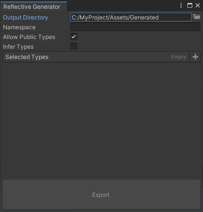
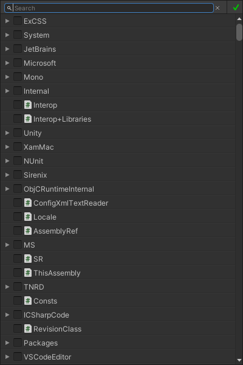

# Reflectives

<p align="center">
	
	<a href="https://github.com/Thundernerd/Unity3D-Reflectives/issues">
		
	</a>
	<a href="https://github.com/Thundernerd/Unity3D-Reflectives/pulls">
		
	</a>
	<a href="https://github.com/Thundernerd/Unity3D-Reflectives/blob/master/LICENSE.md">
		
	</a>
	
</p>

A set of utility classes to make it easier to access hidden functionality.

## Installation
1. The package is available on the [openupm registry](https://openupm.com). You can install it via [openupm-cli](https://github.com/openupm/openupm-cli).
```
openupm add net.tnrd.enumasindex
```
2. Installing through a [Unity Package](http://package-installer.glitch.me/v1/installer/package.openupm.com/net.tnrd.reflectives?registry=https://package.openupm.com) created by the [Package Installer Creator](https://package-installer.glitch.me) from [Needle](https://needle.tools)

[](http://package-installer.glitch.me/v1/installer/package.openupm.com/net.tnrd.reflectives?registry=https://package.openupm.com)

## Usage

Let's assume we have the class below and we want to access some of the hidden functionality
```c#
public class Foo
{
    public int SomeField;

    private int HiddenProperty => SomeField * 10;

    public void NormalPublicMethod()
    {
        [...]
    }
    
    private void SomeHiddenMethod()
    {
        [...]
    }
}
```

There best way to get access to the hidden functionality with the use of Reflectives is like so

```c#
public class ReflectiveFoo : ReflectiveClass
{
    private readonly ReflectiveProperty<int> hiddenProperty;
    private readonly ReflectiveMethod someHiddenMethod;

    public ReflectiveFoo(object instance) : base(instance)
    {
        hiddenProperty = CreateProperty<int>("HiddenProperty");
        someHiddenMethod = CreateMethod("SomeHiddenMethod");
    }

    public ReflectiveFoo(Type type) : base(type)
    {
    }

    public int HiddenProperty
    {
        get => hiddenProperty.GetValue();
        set => hiddenProperty.SetValue(value);
    }

    public void SomeHiddenMethod()
    {
        someHiddenMethod.Invoke();
    }
}
```

Now whenever you want to access the functionality you can easily do so like this

```c#
public void SomeFunction()
{
    Foo foo = GetFoo();

    ReflectiveFoo reflectiveFoo = new ReflectiveFoo(foo);

    int value = reflectiveFoo.HiddenProperty;
    reflectiveFoo.HiddenProperty = 123;

    reflectiveFoo.SomeHiddenMethod();
}
```

The downside of this is that it does require you to write some boilerplate code, however, if you have Odin Inspector you can the `Reflective Generator` to generate reflective classes for you



By clicking the + button on the right side of the window you'll be able to search through all types in the project through the search window



Check the types that you want and click the green checkmark to confirm your selection. Afterwards you simply press the export button and your classes will be generated.

Keep in mind that reflection can be tricky, and the generated code might contain some compile errors from time to time. It is expected that you'll be able to solve those yourself with the given error messages that you'll receive.

## Support
**Reflectives** is a small and open-source utility that I hope helps other people. It is by no means necessary but if you feel generous you can support me by donating.

[](https://ko-fi.com/J3J11GEYY)

## Contributions
Pull requests are welcomed. Please feel free to fix any issues you find, or add new features.

